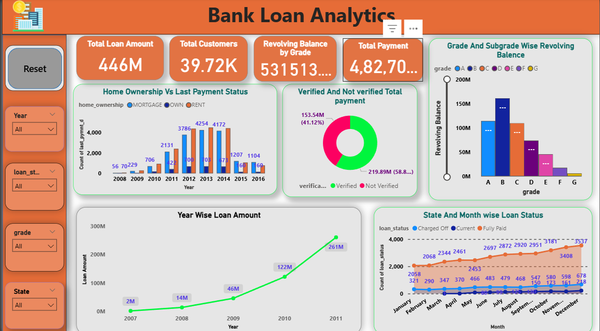
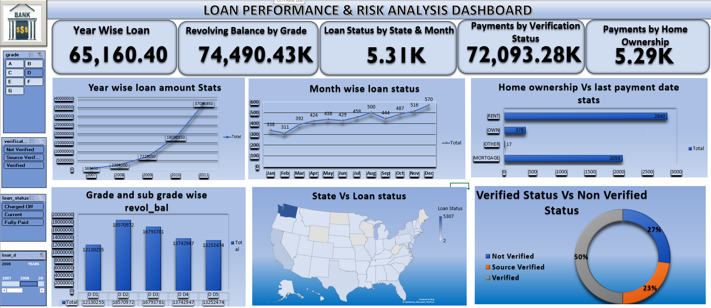

# 📊 Bank Loan Data Analysis & Dashboard Project (SQL + Power BI)

## 📌 Project Overview
This project is an **end-to-end loan data analysis** using **SQL for data exploration and business logic** and **Power BI for visualization and insights**.

The goal is to:
- Analyze loan trends, risk indicators, and repayment behavior
- Identify patterns across time, geography, and borrower profiles
- Present insights through an interactive dashboard

This project is suitable for **Data Analyst / Business Analyst / SQL roles**.

---

## 🗂️ Dataset Description

The analysis is based on two relational tables:

### 1️⃣ finance1 (Loan & Borrower Details)
Contains loan application–level information:

- `id` (Primary Key)
- `loan_amnt`
- `issue_d`
- `grade`
- `sub_grade`
- `loan_status`
- `verification_status`
- `home_ownership`
- `addr_state`

---

### 2️⃣ finance2 (Payment & Credit Behavior)

Contains repayment and revolving credit information:

- `id` (Foreign Key)
- `total_pymnt`
- `revol_bal`
- `last_pymnt_d`

Both tables are joined using **loan id**.

---

# 🔍 SQL Analysis

### 1️⃣ Year-wise Loan Statistics

**Metrics:**

- Total loans issued  
- Total loan amount  
- Average loan amount  

**Purpose:**  
Identify growth trends and lending behavior over time.

---

### 2️⃣ Grade & Sub-grade wise Revolving Balance

**Logic:**  
Join `finance1` and `finance2` tables and aggregate revolving balance.

**Insight:**  
Higher revolving balances in lower grades may indicate elevated credit risk.

---

### 3️⃣ Verified vs Non-Verified Borrowers – Total Payments

**Output:**  
Total payment displayed in **millions (M)** for better readability.

**Insight:**  
Shows whether borrower verification correlates with repayment performance.

---

### 4️⃣ State-wise & Month-wise Loan Status

**Dimensions analyzed:**

- State
- Issue month
- Loan status

**Use Case:**  
Helps identify geographic and seasonal patterns in loan outcomes.

---

### 5️⃣ Home Ownership vs Repayment Activity

**Metric:**  
Count of last payment dates grouped by home ownership type.

**Insight:**  
Evaluates whether asset ownership impacts repayment consistency.

---

# 📊 Advanced SQL Queries

The project also includes advanced SQL queries such as:

- Grade-wise loan count using `HAVING`
- Verification status distribution
- Fully Paid vs Charged Off loan comparison
- Loans issued in specific years
- Loan amount analysis using `IN`
- Loans above overall average using **subqueries**
- Grade-wise average loan using **CTE**
- Charged-off loans with above-average revolving balance
- Customer ranking within grades using **DENSE_RANK()**

---

# 🛠️ SQL Concepts Used

- Aggregations (`SUM`, `AVG`, `COUNT`)
- Joins
- Subqueries
- Common Table Expressions (CTEs)
- Window Functions
- Grouping & filtering
- Date-based analysis

---

# 📈 Power BI Dashboard

### 📊 Dashboard File
- **File:** `Bank_Loan_Analytics.pbix`

### Dashboard Features

The Power BI dashboard visualizes:

- Total loan amount issued
- Total number of customers
- Revolving balance by loan grade
- Verified vs non-verified borrower payments
- Home ownership vs repayment activity
- Year-wise loan amount trends
- State and month-wise loan status

### Purpose of Dashboard

- Convert SQL insights into **visual and interactive reports**
- Enable **quick comparison and trend analysis**
- Support business stakeholders with **data-driven insights**

---

# 📊 Dashboard Preview

---

# 📊 Excel Dashboard

An additional **Excel dashboard** was created to explore loan trends and metrics.

---

# 🔄 SQL → Power BI Workflow

1️⃣ Load raw loan data into SQL database  
2️⃣ Perform joins, aggregations, and analysis using SQL queries  
3️⃣ Validate results and extract insights  
4️⃣ Import processed data into Power BI  
5️⃣ Build interactive dashboards for visualization  

---

# 📂 Project Files

| File | Description |
|-----|-------------|
| Bank_Loan_Analytics.pbix | Power BI dashboard |
| Bank_Loan_Analytics.sql | SQL queries used in analysis |
| Bank_Loan_Dashboard.xlsx | Excel dashboard |
| screenshots | Dashboard images |
| README.md | Project documentation |

---

# 🎯 Skills Demonstrated

- SQL Data Analysis
- Financial Risk Analysis
- Data Visualization
- Power BI Dashboard Development
- Business Intelligence Reporting
- End-to-end analytics workflow

---

# ✅ Conclusion

This project demonstrates a **complete analytics pipeline**:

Raw Data → SQL Analysis → Data Visualization → Business Insights

It reflects real-world **data analyst workflows** and can be used for:

- Portfolio projects
- Interviews
- Case study discussions

---

# 👨‍💻 Author

**Prince Soni**

Aspiring **Data Analyst | SQL | Python | Power BI | Tableau**
